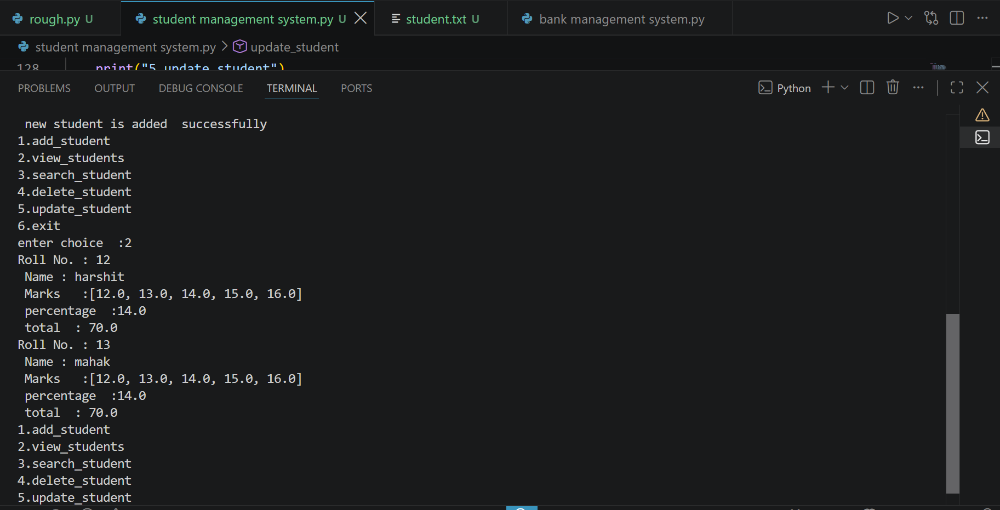

Student Management System

A Python-based Student Management System that allows users to manage student records.

Features

- Add student records
- View all students
- Search students by roll number
- Update student information
- Store student data in a file
- Load saved student data when the program starts
- Exit the program safely

Technologies Used

- Python
- Object-Oriented Programming (OOP)
- File Handling

How to Run

1. Download or clone this repository.
2. Open the Python file in VS Code.
3. Run the program using Python.
4. Follow the options shown in the program.

What I Learned

Through this project, I practiced:

- Classes and objects
- Functions
- Lists
- Loops
- Conditional statements
- File handling
- Reading and writing data to files
- Building a menu-driven Python application

Project Status

Completed ✅

## Screenshots

### full program

### View Students

